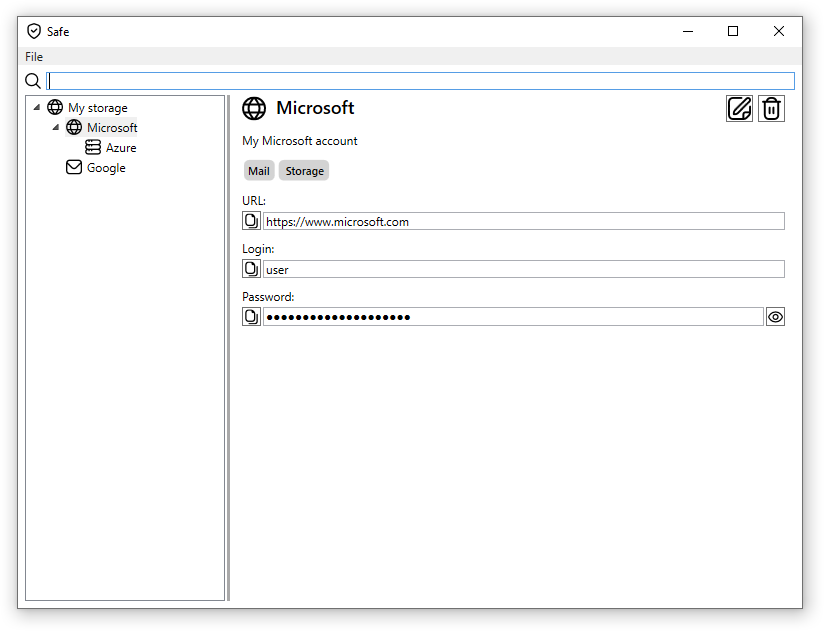

# Safe application

This is an application for storage of passwords and other information in an encrypted storage.

## Features

* You can store any number of items. The application supports hierarchical structure of items.
* You can assign an SVG image for any item.
* You can add any number of tags to an item.
* Each item can contain any number of fields of different types (plain text or password).
* The application supports search of items by title, description, tags, fields content, ...
* You can copy to clipboard any field value by one click of a button.
* You can toggle password visibility.
* You can rearrange order of fields inside an item.
* You can choose location of your storage.
* Your storage is encrypted by your password. ***Be aware! There is no mechanism to restore forgotten password***.
* There is an integrated password generator. It allows you to choose password length and symbol sets.
* You can export and import items with fields to unencrypted JSON file.
* Support of English and Russian UI languages.

## Search

The application supports the search of items. You can use the following rules in the search input box:

* Search text everywhere:

`Microsoft`

* Search all words in all places of one item:

`Mail Microsoft`

* Search exact phrase in everywhere

`"Light bulb"`

* Search only in tags:

`tag:Mail`
`tag:"Light bulb"`

You can also limit your search by:

*Title*: `title:Google`
*Description*: `description:books`
*Field*: `field:sunrise`

## Storage

The application uses [LiteDb](https://www.litedb.org/) as a storage for the items.

## Credits

Icons are taken from [www.flaticon.com](www.flaticon.com).